# КРИПТИКСНОСТЬ V6.7

## МЕЛЛСТРОЙ КЛИЕНТ СДЕЛАННЫЙ ДЫПЫСЫКЫ в4 ФЛËШ

## КРАКЕД БАЙ СИГМА МЕЛЛСТРОЙ ТИМ

> ТРИЛЛИОНЕР ДИПСИК В4 ФЛЕШ БИПАС 676767 САХУР ТУНГ ТУНГ
>
> АНТИЧИТ НЕ ВИДИТ (ПРОВЕРЕНО НА МАМЕ)
>
> 1000000 ФПС ГАРАНТИРОВАНО ИЛИ ВЕРНЁМ ВАШИ ДЕНЬГИ КОТОРЫЕ ВЫ НЕ ПЛАТИЛИ
>
> РАБОТАЕТ НА ХАЙПИКСЕЛЕ\* <sub>\*не работает</sub>

---

## ВИДОСИ

Все фоны — это настоящие видео, разобранные на кадры по 10 fps, со звуком. Ниже — где какой играет.

| ПРЕВЬЮ | ГДЕ ИГРАЕТ | КАДРОВ |
|---|---|---|
| 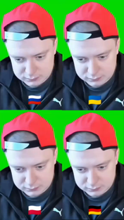 | Мультиплеер | 199 |
| 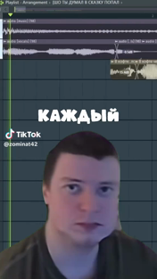 | Прямое подключение | 174 |
| 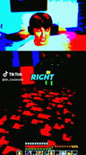 | Добавление сервера | 534 |
| 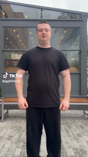 | Выбор мира | 108 |
|  | Создание мира | 200 |
| 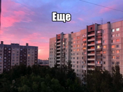 | Настройки | 282 |
|  | Графика | 347 |
| 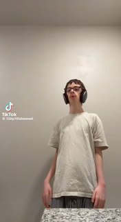 | Звук | 330 |
|  | Скин | 200 |
| 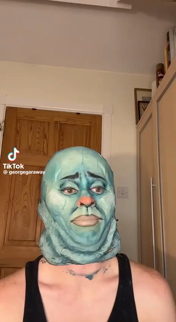 | Управление / Мышь / Клавиши | 150 |
| 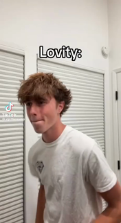 | Язык | 140 |
| 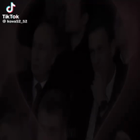 | Чат | 200 |
| 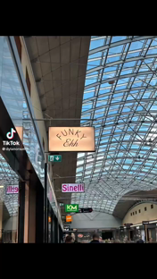 | Ресурспаки | 170 |
| 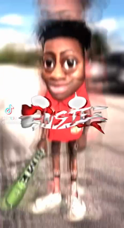 | Спец. возможности | 140 |
| 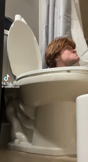 | Онлайн-настройки | 180 |
| 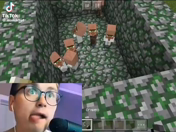 | В запасе (нигде не играет) | 200 |
| 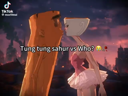 | ВНУТРИ БУКВ ВОТЕРМАРКИ | 200 |

Итого **17 видосов**, ~3500 кадров, 206 МБ чистого искусства.

---

## ФИЧИ

- **ВОТЕРМАРКА КРИПТИКСНОСТЬ** — гигантские буквы, а внутри букв крутится видео. Занимает не больше 1/8 экрана, потому что мы не звери.
- **ИНТРО ОТ МЕЛЛСТРОЯ** — при запуске фон затыкается, играет привет, потом фон обратно.
- **ЛОГОТИП** — вместо лого майнкрафта написано CRYPTIXNOST.
- **ЗАГОЛОВОК ОКНА** — «Cryptixnost 26.2 | trillionaire deepseek v4-flash bipas 676767 sahur tung tung».
- **ПЛАЩИ** — Cryptix, Cat, Pushy, Sky.
- **ЗВУК МИМО НАСТРОЕК ИГРЫ** — видео орут через системный звук, даже если в майне звук выкручен в ноль. Так задумано.
- **ТЕКСТУРЫ БЕЗ FABRIC API** — ассеты мода грузятся прямо из джарника и регистрируются в TextureManager сами, потому что ванильный ресурс-менеджер моды не видит.

---

## СБОРКА

```
./gradlew build
```

Джарка приедет в `build/libs/`. Весит как небольшая игра, зато с видосами.

Требуется: Minecraft 26.2, Fabric Loader 0.19.3, Java 25.

---

## ДИСКЛЕЙМЕР

СДЕЛАНО ДЛЯ УГАРА. НЕ ПРОДАЁТСЯ. КТО ПЕРЕЗАЛЬЁТ — ТОМУ МАМА ПОЗВОНИТ.

<sub>КРАКЕД БАЙ СИГМА МЕЛЛСТРОЙ ТИМ · ДЫПЫСЫКЫ в4 ФЛËШ · V6.7</sub>
